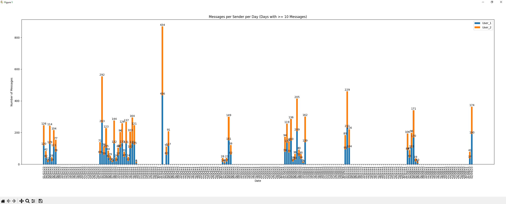
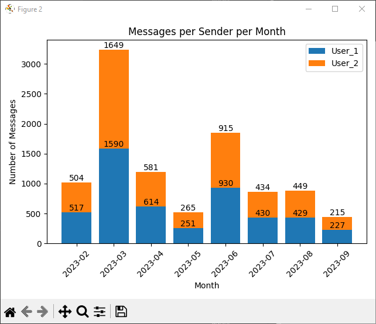

# Whatsapp Texts per Day Histogram Plotter


## How to

1. Open WhatsApp and enter a chat that you want to export.
2. Tap on the three-dot menu.
3. Select the "More" option.
4. Tap on "Export chat"
5. Export it "Without media"
6. Place it inside the "Whatsapp_TextsPerDay" folder (not a requirement)
7. Install all the packages inside [requirements.txt](requirements.txt) with the following command:

    ```pip install -r requirements.txt```
8. Run main.py with the following command:

    ```python main.py chat.txt```

*Instead of chat.txt use the file you exported at point 5.

## Result

The result of the script execution are two histograms:

- Messages per Sender per Day (Days with >= 10 Messages)

    

- Messages per Sender per Month

    

## Test - Code

You can use the provided [chat.txt](chat.txt) to test the script.

⚠️ The code is not polished so don't take it as well written code reference.
